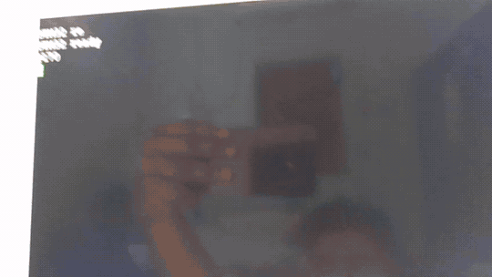
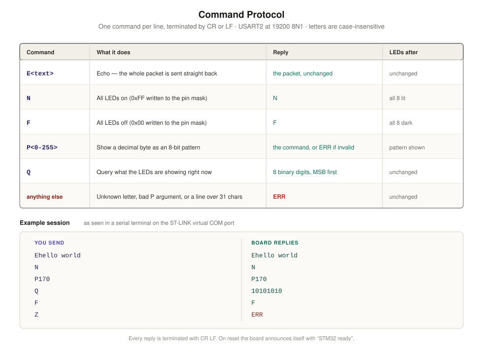
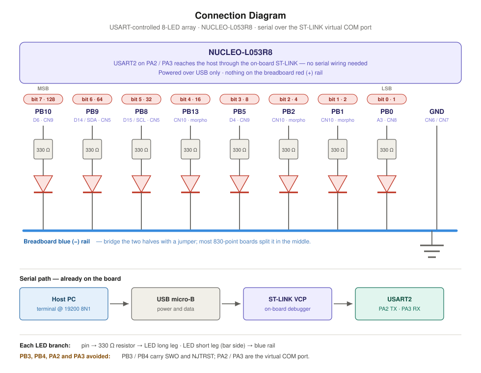
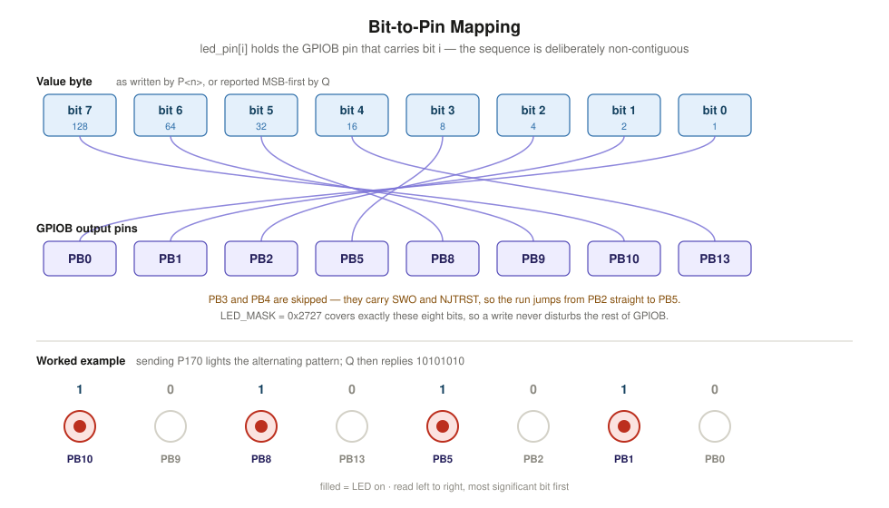
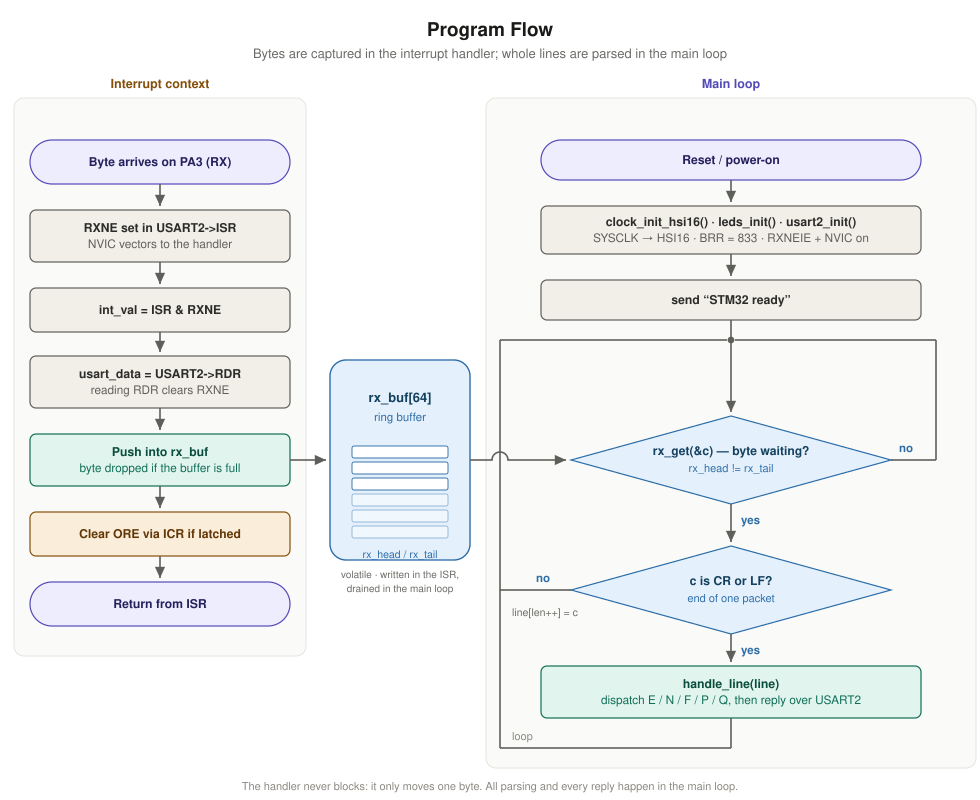

# STM32 Nucleo-L053R8 — USART LED Control

A bare-metal (register-level) STM32 project for the **NUCLEO-L053R8** board
(STM32L053R8, Cortex-M0+). The board listens on its serial port and drives an
array of eight LEDs from short text commands: switch them all on or off, show a
number as a bit pattern, or ask what is currently lit.

Receive is interrupt-driven. The handler does nothing but move one byte into a
ring buffer; every line is assembled, parsed and answered from the main loop.

## Demo

Sending `P170` over the serial port lights the matching bit pattern — `10101010`
across PB10, PB8, PB5 and PB1.



## Command protocol

One command per line, terminated by CR or LF. Letters are case-insensitive.

| Command    | What it does                                        | Reply                          |
|------------|-----------------------------------------------------|--------------------------------|
| `E<text>`  | Echo — the whole packet is sent straight back        | the packet, unchanged          |
| `N`        | All LEDs on                                          | `N`                            |
| `F`        | All LEDs off                                         | `F`                            |
| `P<0-255>` | Show a decimal byte as an 8-bit pattern              | the command, or `ERR`          |
| `Q`        | Query what the LEDs are showing                      | 8 binary digits, MSB first     |

Anything else — an unknown letter, a `P` argument that is not a number in
range, or a line longer than 31 characters — is answered with `ERR`. Every
reply ends in CR LF, and the board announces itself with `STM32 ready` on reset.



## Talking to the board

USART2 is routed to the ST-LINK virtual COM port, so the same USB cable that
powers and flashes the board also carries the serial link — nothing extra to
wire. Open the ST-LINK COM port in any terminal at:

```
19200 baud · 8 data bits · no parity · 1 stop bit · no flow control
```

Turn on local echo if you want to see what you are typing, and make sure the
terminal sends a CR or LF when you press Enter.

## Hardware / wiring

Eight LEDs hang off GPIOB, each through its own 330 Ω resistor to the ground
rail. The pins are deliberately non-contiguous.

| Bit | Weight | Pin  | Board header      |
|-----|--------|------|-------------------|
| 7   | 128    | PB10 | D6 · CN9          |
| 6   | 64     | PB9  | D14 / SDA · CN5   |
| 5   | 32     | PB8  | D15 / SCL · CN5   |
| 4   | 16     | PB13 | CN10 · morpho     |
| 3   | 8      | PB5  | D4 · CN9          |
| 2   | 4      | PB2  | CN10 · morpho     |
| 1   | 2      | PB1  | CN10 · morpho     |
| 0   | 1      | PB0  | A3 · CN8          |

`PB3` and `PB4` are skipped because they carry SWO and NJTRST, and `PA2` / `PA3`
are left alone because they are the virtual COM port.



## Bit-to-pin mapping

`led_pin[i]` holds the GPIOB pin carrying bit `i` of the value, so spreading a
byte across the scattered pins is a loop rather than a shift. `LED_MASK`
(`0x2727`) covers exactly those eight bits, which lets a write land with a
single read-modify-write that leaves the rest of GPIOB untouched.



## Output and input control method

Output goes straight through the GPIO **Output Data Register (ODR)** — no HAL
abstraction on the output path. `Q` reads the same register back rather than
tracking the pattern in a variable, so the reply always describes the pins as
they actually stand.

## Program flow

The interrupt handler is kept as short as possible: read the status register,
read `RDR` (which clears `RXNE`), push the byte, clear a latched overrun, and
return. Nothing in it blocks, and no reply is ever sent from interrupt context.



## USART configuration

The L0 boots on MSI at roughly 2.1 MHz, which will not produce the required
baud rate, so `clock_init_hsi16()` switches SYSCLK to the 16 MHz internal
oscillator before the peripheral is set up.

| Setting        | Value                                                  |
|----------------|--------------------------------------------------------|
| Peripheral     | USART2 on PA2 (TX) / PA3 (RX), alternate function 4     |
| Clock          | HSI16, 16 MHz                                           |
| `BRR`          | 833 → 16 000 000 / 833 = 19 208 baud, 0.04 % off 19 200 |
| Frame          | 8N1, no flow control                                    |
| Interrupt      | `RXNEIE`, NVIC priority 1 (Cortex-M0+ has levels 0–3)   |
| Receive buffer | 64-byte ring buffer, bytes dropped when full            |
| Line buffer    | 32 bytes, so 31 usable characters                       |

## Building

Open the project in **STM32CubeIDE** and build, or flash the resulting ELF with
your preferred tool. Source of interest: [`Core/Src/main.c`](Core/Src/main.c).

The whole firmware is small enough to leave most of the part empty:

```
   text    data     bss     dec     hex
   2500       4    1644    4148    1034
```

The `Debug/` build output and IDE `*.launch` files are intentionally excluded
from version control.

## Repository layout

| Path                    | Contents                                            |
|-------------------------|------------------------------------------------------|
| `Core/Src/main.c`       | the entire application — LEDs, USART, parser         |
| `Core/Startup/`         | vector table and reset handler                       |
| `Drivers/`              | vendored ST HAL and CMSIS headers                    |
| `docs/`                 | diagrams used by this README                         |
| `STM32L053R8TX_FLASH.ld`| linker script                                        |

## Related

The same board and the same register-level approach, one lab earlier:
[stm32-nucleo-l053r8-random-binary-display](https://github.com/tathagata48/stm32-nucleo-l053r8-random-binary-display)
— LEDs show a random number in binary on a button press.

## License

This project's own code is released under the [MIT License](LICENSE).

The vendored STMicroelectronics HAL and CMSIS sources under `Drivers/` are
distributed under their respective ST / Arm licenses (see the `LICENSE.txt`
and `License.md` files within those folders).
